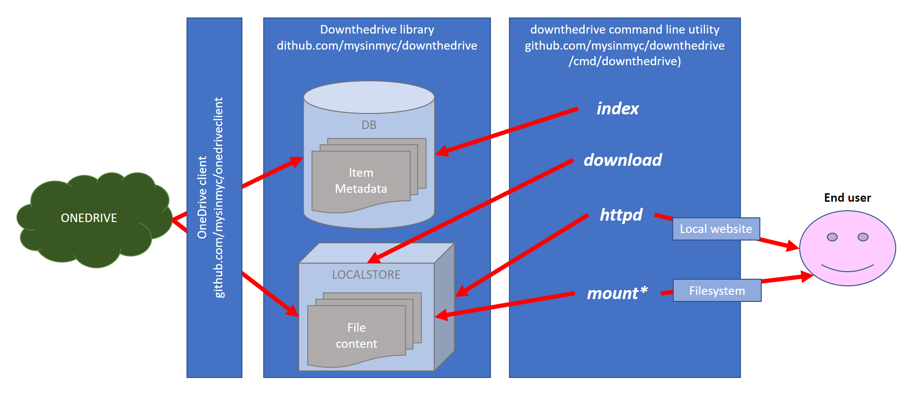

# downthedrive 


I like Microsoft OneDrive as a cheap an fast solution well integrated to store my data in the cloud. 

With this project I've explored some possible integrations with my personal onedrive by using [OneDrive API](https://dev.onedrive.com/README.htm)

DownTheDrive is a library and a commandline utility to perform some nice operations on my personal onedrive.
 

## Status of the project

it's a prerelease under development. Actually is exposes the drive only in read

### TODO LIST

- [ ] LOCALSTORE: parameterize localstore (type,..) in the cmd actions
- [ ] LOCALSTORE: Implement SHA1 based 
- [ ] LOCALSTORE: Clean
- [ ] HTTP functionalities
- [ ] Authentication improvement (save token, logout...) 
- [ ] obfuscation/encryption 
- [ ] incremental updates (by using cTag or by  /view.delta)
- [ ] clean deleted items
- [ ] ??? read/write linux fs ???


## Installation

```
go get github.com/mysinmyc/downthedrive/cmd/downthedrive
```


## Some concepts




### configuration

DownTheDrive configuration is mainly stored in a json file at the following location
* windows: *%APPDATA%\\.downthedrive\\config.json*
* linux: *$HOME/.downthedrive/config.json*

The configuration file constains  parameters to connect to a database
The database can contains additional configuration informations in the table beans (also authentication informations)


### index db

Depending on *-indexStrategy* parameter, all the items exposed to the user are cached in a table named ITEMS. This table allows to speed up drive navigation.

By default items are cached for 15 days (for infrequently changes).

To modify index behaviours:
* it could be forced an update by using command `downthedrive index`
* start the program with the parameter *-indexStrategy 2* to access directly to the drive without local indexes

By default indexdb is a sqlite3 file under the .downthedrive folder. SqlLite3 can generate issues in case of concurrent read/write activity

To switch to mysql  modify *.downthedrive/config.json* file  as follows

```
        "Db": {
                "DataSource": "{user}:{password}@tcp({host}:3306)/downthedrive?parseTime=true",
                "Driver": "mysql"
        },

```


### local store 

Before to provide to the user, files are downloaded/cached into a folder called local store. By default it is located in *.downthedrive/localStore*; it can be changed by using parameter *-localStorePath {localStorePath}* 


## How to 


### Authentication

Downthedrive requires a permanent access token to the user drive. At the time it requires only read access to the drive. Authentication has been developed to be executed on a browser located in a different machine (in case the utility runs on a server without a browser)

To Perform authentication,  clientId and a clientSecrect are require. They can be obtained by following the instruction at [dev.onedrive.com](https://dev.onedrive.com/app-registration.htm). 
Registered application must:
* be registered as mobile applciation
* have the following reditect url https://login.live.com/oauth20_desktop.srf

Authentication can be started by executing

```
downthedrive authenticate -clientId {clientId} -clientSecret {clientSecret}
```

During the authentication will be asked to copy and paste an url to a browser and then to paste back the url containing the token from the browser in order to reedim it

** WARNING: currently client secret and authentication token are stored as plain text in the database  **


### Index the drive

To index a path tree inside the database use the following command:

```
downthedrive index -drivePath {drivePath}
```


specify / as drivePath to index the entire drive


### Download files from drive

To download a folder locally from the drive type the following command:

```
downthedrive download -drivePath {drivePath} -localPath {local path where to store items}

```


### Navigate the drive content via a local website

To start an httpd  execute the following command

```
downthedrive httpd
```

by default httpd is listening on localhost:8080; to change it specify parameter *-listen {listenAddess} *


### Mount a readonly filesystem (available only in linux)

In Linux downthedrive can mount a local filesystem that exposes the drive. 

This option requires **fuse** installed locally 

To mount the drive execute:

```
downthedrive mount -drivePath {drivePath} -mountPoint {mountpoint}
```

mountpoint must exists and must be writeable by the user

By default root and others cannot access the mounted filesytem except if *-allowOther true* poptions is passed to downthedrive.
It can be usefull in some uses cases like filesystem export via samba 


To umount the filesystem use the command `downthedrive unmount -mountPoint {mountPoint}


## External dependencies

This project depends directly on the following external projects, I thanks to the authors

* Only in linux [bazil.org/fuse](https://github.com/bazil/fuse)
* [go-sql-driver/mysql](https://github.com/go-sql-driver/mysql)
* [mattn/go-sqlite3](https://github.com/mattn/go-sqlite3)

Before using it please check license compatibility for your use cases

